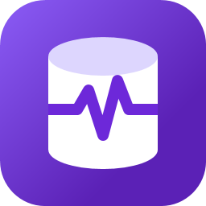

<p align="center">
  
</p>

<h1 align="center">SqlVitals</h1>

<p align="center">
  <strong>Check the pulse of your SQL Server or Azure SQL database, spot trouble early and fix it with confidence.</strong>
</p>

<p align="center">
  
  
  
  <a href="LICENSE"></a>
  <a href="https://github.com/aselasampath/sqlvitals/actions/workflows/pr-setup.yml"></a>
  <a href="https://github.com/aselasampath/sqlvitals/releases/latest"></a>
</p>

**SqlVitals** is a free, open-source Windows desktop app that shows what your SQL Server or Azure SQL
database is doing right now, and what it was doing while you weren't watching. It reads the server's own
dynamic management views (DMVs) directly: there's no agent to install on the server, no monitoring database
to look after and no web service in between. Add a connection, and waits, blocking, TempDB pressure, memory
grants, slow queries and index problems are on screen in seconds.

Built for DBAs and developers who need a clear answer to *"why is the database slow?"*, without setting up a
monitoring platform first.

- 🩺 **See it live.** Live metrics, active waits, blocking chains and a live stored-procedure trace.
- 🔔 **Know when something's wrong.** Every saved connection can be watched in the background. A health dot
  and a 0–100 health score in the sidebar show its state, and alerts record which threshold was crossed, when, for how
  long and how badly.
- 🕰️ **Go back in time.** A local history on your PC keeps metrics, waits and top queries, so you can look into
  last night's incident or compare today with the same time last week.
- 📉 **Catch regressions early.** Query Regressions flags queries that got slower, with their before
  and after figures and execution plans, so a plan regression stands out.
- 🛠️ **Fix, not just find.** Generate `CREATE INDEX`, `DROP INDEX`, index maintenance and `UPDATE STATISTICS`
  scripts from what it finds. SqlVitals never runs them itself: you review them and decide.
- 🪶 **Light on your servers.** Diagnostic reads run under `READ UNCOMMITTED` with a timeout, only lightweight
  queries run in the background, and heavy pages run only when you open them.
- 🔒 **Careful with credentials.** Saved connections are encrypted with Windows DPAPI, and passwords are never
  written to disk unless you ask for it.
- 📤 **Easy to share.** Copy or export any grid to CSV, or export a structured report ready to paste into an AI
  assistant.

**Get started:** download `SqlVitals-Setup-<version>.exe` from the latest
[release](https://github.com/aselasampath/sqlvitals/releases/latest) and run it (no admin rights needed, .NET
runtime included). You can also [build and run it from source](#how-to-build--run).

Built with **WPF on .NET 8**. Current version: **0.36.1** (set in `SqlVitals/Desktop/SqlVitals.Desktop.csproj` → `<Version>`)

---

## Why SqlVitals?

**SSMS is where you *administer* SQL Server. The Azure portal and Azure Monitor are where you see *platform
metrics* for Azure resources. SqlVitals is where you *diagnose*: it watches every server you look after,
remembers what happened, tells you when something goes wrong and takes you from symptom to cause to a fix
script in a few clicks. It's free, and you can start in minutes with nothing to set up on the server or in Azure.**

The gap it fills: SSMS shows one server, only while you're looking, and forgets it when you close the window.
Azure's monitoring covers Azure resources, at one-minute granularity, and its deeper data needs a Log Analytics
workspace, which you set up and pay for per GB. A commercial monitoring product needs a server, a repository
database and a budget. SqlVitals sits between them: continuous and remembering like a monitoring product, and as
quick to start as SSMS.

### What each role gets at a glance

**🧑‍💼 DBA: which server needs me, and why?**

- **A 0–100 health score and a 🟢 🟠 🔴 dot for every server** in one list, on-premises and Azure side by side.
  Click a score to see exactly which checks lowered it: CPU, blocking, page life expectancy, memory grants, log
  or TempDB space.
- **It keeps watching while you work elsewhere**, even with the window closed to the notification area. A threshold
  breached for a few samples in a row becomes an **alert** with its start, end and worst value, and a **Windows
  notification**.
- **"What happened at 2 a.m.?"** answered from a local history of metrics, waits, file I/O and top queries, with a
  dashed **same time last week** baseline on the charts.
- **A visual blocking map** that shows the head blocker (often a sleeping session with an open transaction) and its
  SQL.
- **Maintenance scripts, not guesswork.** Missing and unused indexes, fragmentation and stale statistics become
  `CREATE` / `DROP` / `REBUILD` / `UPDATE STATISTICS` scripts. You review them; SqlVitals never runs them.
- **Easy to approve for production:** read-only, `READ UNCOMMITTED` reads with timeouts, one light query per server
  every 10 s in the background plus a snapshot every 5 minutes, and `VIEW SERVER STATE` (or `VIEW DATABASE STATE` on Azure SQL Database) is enough
  for every screen except the Extended Events mode of SP Trace.

**👩‍💻 Database developer: why is *my* query slow, and did my release make it worse?**

- **Query Regressions:** queries whose duration or CPU rose past a threshold, before and after side by side, with
  both execution plans. Without Query Store, it uses SqlVitals' own history instead.
- **Graphical execution plans like SSMS**, with costly operators, warnings, bad row estimates and missing-index
  hints highlighted. Open them straight from the busiest queries, a regression or a traced procedure call.
- **The usual culprits, already found:** implicit conversions that force scans, the most expensive queries by CPU
  and reads, queries that fail to parameterise or are badly estimated, stale statistics and missing indexes.
- **Live stored-procedure trace:** every call with its duration, CPU and reads as it happens. It creates a
  temporary Extended Events session and cleans it up afterwards.
- **No DMV knowledge needed:** the queries behind every screen are written, tuned and safe for Azure SQL and
  on-premises alike.

**🛠️ Operations and on-call: is it the database, and who do I call?**

- **Green, amber or red, and a number.** Anyone can read it without knowing SQL Server internals, and hovering or
  clicking says what's wrong in plain words.
- **Notifications, not dashboards to stare at.** An alert that starts or turns critical pops up in Windows. Clicking
  it opens the timeline for that server.
- **"Is the server even up?"** An unreachable server shows 🔴 and a score of 0 with the connection error.
- **A report to hand over:** export the server's state as structured text, ready to paste into a ticket, a chat or
  an AI assistant. Copy or export any grid to CSV.
- **Installs in a minute** without admin rights, with the .NET runtime included.

### How it compares

| | SqlVitals | SSMS | Azure portal / Azure Monitor |
|---|---|---|---|
| On-premises SQL Server and Azure SQL in one view | ✅ | ✅ | Azure SQL. On-premises needs Azure Arc |
| Several servers watched continuously, with a health score each | ✅ | ❌ Activity Monitor: one server, while open | ⚠️ Per-resource metrics and alert rules you configure |
| History of waits, metrics and top queries, compared with last week | ✅ Local, retention you choose | ⚠️ Query Store reports, per database | ⚠️ Platform metrics; deeper data needs Log Analytics (billed per GB) |
| Sample interval | 5 s to 2 min | Activity Monitor refresh | 1 minute |
| Alerts with start, end and worst value, plus desktop notifications | ✅ Built in | ⚠️ SQL Agent alerts, set up per server (on-premises) | ✅ Alert rules and action groups, set up per resource |
| Blocking chain map with the head blocker | ✅ | ⚠️ A column in Activity Monitor | ❌ |
| Query regressions with before and after plans | ✅ Query Store or its own history | ⚠️ Regressed Queries report, Query Store only | ⚠️ Query Performance Insight, Azure SQL Database only |
| Fix scripts for indexes and statistics | ✅ Review, then run yourself | ⚠️ Missing-index hint in a plan | ⚠️ Automatic tuning recommendations, Azure SQL only |
| Nothing to install on the server, no workspace, no cost | ✅ | ✅ | ⚠️ Log Analytics and some features are billed |

*A fair summary of the built-in tools as usually used; SSMS and Azure change often, and both do far more than
this table shows.*

### What SqlVitals is not

Being clear about this is part of the pitch:

- **Not an administration tool.** It never changes your server. Keep SSMS (or Azure Data Studio) for creating
  objects, security, backups and running the scripts SqlVitals generates.
- **Not a team monitoring platform.** History and alerts live on the PC running SqlVitals, and are collected only
  while it runs (it keeps running in the notification area). There's no shared web dashboard, central repository or
  paging. If you need 24/7 monitoring for a team with long retention, use a server-based product. SqlVitals is a good
  way to find out what you need from one.
- **Windows only.** It's a WPF desktop app.

---

## Table of Contents

1. [Why SqlVitals?](#why-sqlvitals)
2. [Overview](#overview)
3. [Architecture](#architecture)
4. [Solution Structure](#solution-structure)
5. [Tech Stack & NuGet Packages](#tech-stack--nuget-packages)
6. [Configuration](#configuration)
7. [How to Build & Run](#how-to-build--run)
   - [Installer (SqlVitals Setup)](#installer-sqlvitals-setup)
8. [Navigation & Pages](#navigation--pages)
9. [Adding a New Page — Step-by-Step](#adding-a-new-page--step-by-step)
10. [Repository Pattern](#repository-pattern)
11. [Where the SQL Lives](#where-the-sql-lives)
12. [Data Models](#data-models)
13. [Query Wrapper (NOLOCK + Timeout)](#query-wrapper-nolock--timeout)
14. [Azure SQL vs On-Premises Compatibility](#azure-sql-vs-on-premises-compatibility)
15. [Export / AI Report Feature](#export--ai-report-feature)
16. [Live SP Trace](#live-sp-trace)
17. [Styling & Themes](#styling--themes)
18. [Common Errors & Fixes](#common-errors--fixes)

---

## Overview

SqlVitals connects **directly** to a SQL Server or Azure SQL database and surfaces
live diagnostic data across the app's monitoring screens:

- Wait statistics (cumulative, active, categories, top types)
- TempDB pressure and file usage
- Memory grants and memory clerks
- Query Store top queries
- Query regressions: queries whose average duration or CPU rose past a threshold, before and after side by side, with their execution plans (Query Store, or the monitoring history)
- Index health (missing, unused, usage, fragmentation) with script generators to create missing indexes, drop unused ones and reorganize or rebuild fragmented ones
- Resource-intensive queries (reads + CPU)
- Index usage patterns and fragmentation
- Implicit type conversions
- Graphical execution plans like SSMS: each statement's operator tree with icons, costs, row-count arrows, warnings, bad estimates (actual plans) and missing-index hints; hover for details, click for every property, find, zoom, pan and export as PNG. The raw XML is on a second tab
- Stale statistics, with a script generator to update them (default sampling or FULLSCAN)
- Database storage, file sizes, and server configuration
- Live stored-procedure tracing (SP Trace)
- Export / AI report generator
- Right-click any grid to Copy, Copy with headers, or Export to CSV (UTF-8)
- Filter box on the Resource Queries, Index Health, Query Store and Query Regressions grids, and a column sort that survives Refresh
- Local monitoring history: every monitored connection's metrics, waits, file I/O, memory and top queries saved to `%LocalAppData%\SqlVitals\history.db` (SQLite; snapshot interval and retention set in Settings)
- A health dot per connection in the sidebar, graded on thresholds you set in Settings (CPU, blocking, page life expectancy, memory grants pending, log and TempDB space), for every connection or just one
- A 0–100 health score per connection, from the same checks weighted by importance, in the connection selector and on the Live Metrics dashboard; click it to see which checks lowered it
- Alerts: a threshold breached for a few samples in a row is recorded with its start, end and worst value, and listed on the Alerts page (active and past, filtered by connection)
- Windows notifications when an alert starts or turns critical (click to open the Alerts page for that connection; mute per connection), and a notification-area icon: minimizing or closing the window keeps SqlVitals monitoring in the background
- Light theme (default) and dark theme, switchable in Settings

---

## Architecture

```
┌──────────────────────────────────────────────────────────┐
│                  SqlVitals.Desktop (WPF)                   │
│                                                           │
│   MainWindow                                             │
│   ├── Sidebar navigation                                 │
│   ├── Frame → navigates to Page objects                  │
│   └── Refresh button → calls IRefreshable.RefreshAsync() │
│                                                           │
│   Services/RepositoryFactory                             │
│   └── Builds the repository for the active connection    │
│                                                           │
│   Pages                                                  │
│   └── Each page holds IWaitStatsRepository reference     │
│       and calls it in RefreshAsync()                     │
│                                                           │
│   ExportService                                          │
│   └── Fires all selected queries concurrently,           │
│       writes structured text report for AI pasting       │
└───────────────────────┬──────────────────────────────────┘
                        │  Project reference (no HTTP)
                        ▼
┌──────────────────────────────────────────────────────────┐
│         SqlVitals.Engine (Microsoft.NET.Sdk.Web library)   │
│                                                           │
│   Repositories/                                          │
│   ├── IWaitStatsRepository  (interface)                  │
│   ├── WaitStatsRepository   (Dapper implementation)      │
│   └── SpTrace / TempDb / PlanCacheHealth repositories    │
│                                                           │
│   Models/    (C# record types, one file per feature area)│
│   Scripting/ (T-SQL script generators, e.g. DROP INDEX)  │
│   Export/    (CSV / TSV text for grid copy and export)   │
│   Filtering/ (text matching for the grid filter boxes)   │
│   Controllers/ + ApiHost.cs / Program.cs                 │
│   └── Optional standalone REST host — not used by Desktop│
└───────────────────────┬──────────────────────────────────┘
                        │  Dapper + Microsoft.Data.SqlClient
                        ▼
              SQL Server / Azure SQL Database
```

> **Key design decision:** `SqlVitals.Desktop` references `SqlVitals.Engine` as a
> **project reference**, not via HTTP. `MainWindow` gets the repository for the active
> connection from `RepositoryFactory` (in `SqlVitals/Desktop/Services/`). This means zero network latency and no background web server needed.
> `SqlVitals.Engine` also contains a `Program.cs` / `ApiHost.cs` (and `Controllers/`) for
> running as a standalone REST API if needed in future, but the desktop app doesn't use it.
> Everything the app needs — models, repositories, and the optional REST surface — lives
> in this single project; there is no separate data-access project.

---

## Solution Structure

All paths are relative to the repository root.

```
(repo root)
├── SqlVitalsDashboard.slnx                ← Solution file (open this in Visual Studio)
├── README.md
├── LICENSE
├── .github/workflows/pr-setup.yml         ← CI: tests + Setup build on every PR to main
├── .github/workflows/release.yml          ← Release: tag vX.Y.Z → tests, Setup build, GitHub Release
├── TODO/wait-stats-ui/                    ← Parked React web UI (not part of the solution)
│
└── SqlVitals/
    ├── Desktop/                           ← WPF application (net8.0-windows) — the app users run
    │   ├── SqlVitals.Desktop.csproj       ← <Version> here is the release number
    │   ├── App.xaml / App.xaml.cs         ← Theme loading + ToggleTheme()
    │   ├── MainWindow.xaml                ← Shell: connection selector + sidebar + frame + status bar
    │   ├── MainWindow.xaml.cs             ← Navigation (NavigateTo) + connection switching
    │   ├── Pages/
    │   │   ├── IRefreshable.cs            ← Interface every page must implement
    │   │   └── ...Page.xaml/.cs           ← One file pair per screen
    │   ├── Controls/                      ← ProcessMapControl, GridFilterBox (grid filter box),
    │   │                                     TimeRangePicker (Live / 1h / 24h / 7d / Custom and Compare to baseline on trend pages),
    │   │                                     HealthThresholdsEditor (warning / critical boxes per health indicator),
    │   │                                     HealthScoreBreakdown (the checks behind a health score, shown when it's clicked)
    │   ├── Windows/                       ← SqlScriptWindow, QueryExecutionPlanWindow
    │   ├── Helpers/                       ← ChartTheme, BaselineSeries (dashed baseline lines), ClipboardHelper, DataGridExport (grid right-click menu),
    │   │                                     DataGridRefresh (reload a grid keeping its sort and filter), HealthBrushes (health dot colours)
    │   ├── Services/
    │   │   ├── AppLog.cs                  ← Daily diagnostic log in %AppData%\SqlVitals\logs (14-day retention)
    │   │   ├── ConnectionSettingsService.cs ← Saved connections (DPAPI-encrypted)
    │   │   ├── RepositoryFactory.cs       ← Builds the repository for the active connection
    │   │   ├── MonitoringManager.cs       ← Background live-metrics collectors, one per connection
    │   │   ├── MonitoringSession.cs
    │   │   ├── TrayIcon.cs                ← Notification-area icon, its menu, and the Windows notifications for alerts
    │   │   ├── ConnectionHistory.cs       ← A connection's history for the trend pages; reads off the UI thread; BaselineTracker
    │   │   └── ExportService.cs           ← Concurrent multi-group AI export
    │   └── Styles/
    │       ├── Theme.xaml
    │       ├── LightTheme.xaml            ← Default theme
    │       └── DarkTheme.xaml
    │
    ├── Engine/                            ← Class library + optional web API (net8.0, Microsoft.NET.Sdk.Web)
    │   ├── SqlVitals.Engine.csproj
    │   ├── appsettings.json               ← Default connection string + query settings
    │   ├── Models/                        ← C# record types for every query result
    │   ├── Repositories/
    │   │   ├── IWaitStatsRepository.cs    ← Main interface — the query methods pages call
    │   │   ├── WaitStatsRepository.cs     ← Dapper implementation (SQL embedded as raw strings)
    │   │   ├── BaseRepository.cs          ← Q() / QFirst() query wrappers
    │   │   ├── SpTraceRepository.cs, TempDbRepository.cs, PlanCacheHealthRepository.cs
    │   │   ├── HistoryRepository.cs       ← Server reads for the 5-minute history snapshot
    │   │   ├── QueryRegressionRepository.cs ← Query Store stats and plans for Query Regressions
    │   │   └── SpTraceXmlParser.cs, ProcedureStatsDelta.cs ← Pure helpers for SP Trace
    │   ├── History/
    │   │   ├── HistoryStore.cs            ← The SQLite file: schema, writes, purge, corrupt-file recovery
    │   │   ├── HistoryWriter.cs           ← Background queue + writer thread shared by all connections
    │   │   ├── HistoryRecorder.cs         ← Per connection: queues samples, takes detail snapshots
    │   │   ├── HistoryDetailTracker.cs    ← Turns cumulative DMV totals into per-interval changes
    │   │   ├── HistoryReader.cs           ← Read-only: past ranges for the trend pages, averaged into buckets
    │   │   ├── HistoryRange.cs, HistoryGaps.cs ← Range picker choices, bucket sizes; where a chart breaks its line
    │   │   └── HistoryBaseline.cs         ← The same time last week, lined up under the current data
    │   ├── Alerts/
    │   │   ├── AlertTracker.cs            ← Per connection: turns graded samples into alerts (start / escalate / end)
    │   │   ├── Alert.cs                   ← Alert, AlertChange, AlertText (how the Alerts page words figures)
    │   │   ├── AlertNotification.cs       ← The Windows notification's title and text for what a sample did to the alerts
    │   │   └── AlertSettings.cs           ← Samples in a row before an alert starts (Settings choices)
    │   ├── Regressions/
    │   │   ├── RegressionWindows.cs       ← The recent period and the baseline it is compared with
    │   │   └── QueryRegressionDetector.cs ← Which queries got slower, and by how much (RegressionCriteria)
    │   ├── Scripting/
    │   │   ├── UnusedIndexDropScript.cs   ← Builds the Index Health DROP script
    │   │   ├── MissingIndexCreateScript.cs ← Builds the Index Health CREATE script
    │   │   ├── IndexMaintenanceScript.cs  ← Builds the Index Health REORGANIZE / REBUILD script
    │   │   └── UpdateStatisticsScript.cs  ← Builds the Stale Statistics UPDATE STATISTICS script
    │   ├── Export/
    │   │   └── DelimitedText.cs           ← CSV / tab-separated text for grid copy and export
    │   ├── Filtering/
    │   │   └── RowFilter.cs               ← Term parsing and row matching for the grid filter boxes
    │   ├── Monitoring/                    ← LiveMetricSample, HealthRules; HealthThresholds (health-dot thresholds);
    │   │                                     HealthScore (the 0–100 score and the checks that lowered it)
    │   ├── Controllers/                   ← REST endpoints (only used if running as API)
    │   ├── Errors/                        ← WaitStatsException
    │   ├── ApiHost.cs / Program.cs        ← Web API host (not used by the desktop app)
    │   └── wwwroot/                       ← Static assets for standalone API mode
    │
    ├── Engine.Tests/                      ← xUnit tests for Engine (net8.0)
    │
    ├── Installer/                         ← SqlVitals Setup wizard (WPF, net472)
    │   ├── SqlVitals.Installer.csproj     ← Produces SqlVitals.Setup.exe
    │   ├── Build-Installer.ps1            ← Builds artifacts\SqlVitals-Setup-<version>.exe
    │   ├── Core/                          ← Install logic, no WPF dependency
    │   └── Views/                         ← Wizard pages
    │
    ├── Installer.Tests/                   ← xUnit tests for Installer/Core (net472)
    │
    └── Branding/                          ← App icon sources + Build-Icon.ps1
```

The solution contains five projects: `SqlVitals.Desktop`, `SqlVitals.Engine`,
`SqlVitals.Engine.Tests`, `SqlVitals.Installer` and `SqlVitals.Installer.Tests`.

---

## Tech Stack & NuGet Packages

| Package | Version | Used in | Purpose |
|---|---|---|---|
| `Dapper` | 2.1.72 | `SqlVitals.Engine` | Micro-ORM — maps SQL results to C# records |
| `Microsoft.Data.SqlClient` | 5.2.2 | `SqlVitals.Engine` | SQL Server / Azure SQL driver |
| `Microsoft.Data.Sqlite` | 8.0.31 | `SqlVitals.Engine` | Local monitoring history file (see [Monitoring history](#monitoring-history)) |
| `Microsoft.AspNetCore.OpenApi` | 8.0.23 | `SqlVitals.Engine` | Swagger (API mode only) |
| `Swashbuckle.AspNetCore` | 6.6.2 | `SqlVitals.Engine` | Swagger UI (API mode only) |
| `LiveChartsCore.SkiaSharpView.WPF` | 2.0.0-rc4.5 | `SqlVitals.Desktop` | Charts (bar, pie, line) |
| `System.Security.Cryptography.ProtectedData` | 8.0.0 | `SqlVitals.Desktop` | DPAPI encryption of saved connections |
| `xunit` | 2.9.3 | `*.Tests` | Unit tests |

**Target frameworks:**

| Project | Framework |
|---|---|
| `SqlVitals.Desktop` | `net8.0-windows` (WPF) |
| `SqlVitals.Engine` | `net8.0` (`Microsoft.NET.Sdk.Web`) |
| `SqlVitals.Engine.Tests` | `net8.0` |
| `SqlVitals.Installer` | `net472` (WPF), so Setup runs on a clean Windows install |
| `SqlVitals.Installer.Tests` | `net472` |

---

## Configuration

You don't have to edit any file to get started: add a connection on the app's **Settings**
page (it opens automatically on first launch). `SqlVitals/Engine/appsettings.json` holds the
defaults that saved connections are layered on top of:

```json
{
  "ConnectionStrings": {
    "SqlServer": ""
  },
  "QuerySettings": {
    "CommandTimeoutSeconds": 30,
    "UseNoLock": true
  }
}
```

| Setting | Default | Description |
|---|---|---|
| `ConnectionStrings:SqlServer` | *(empty)* | Fallback ADO.NET connection string, used only when no connection is saved in Settings |
| `QuerySettings:CommandTimeoutSeconds` | `30` | Max seconds any query may run before being cancelled |
| `QuerySettings:UseNoLock` | `true` | Prepends `SET TRANSACTION ISOLATION LEVEL READ UNCOMMITTED` to all queries (avoids blocking on monitored server) |

> **Azure SQL:** Use `TrustServerCertificate=false` and `Encrypt=true` (default).
> **On-premises:** Set `TrustServerCertificate=true` for self-signed certs.

The build copies the file to `SqlVitals/Desktop/bin/Debug/net8.0-windows/appsettings.json`
through the `<None Update>` entry in `SqlVitals.Desktop.csproj`, so edit the one in `Engine/`.

Connections entered in the app's **Settings** page are saved per-user (DPAPI-encrypted)
to `%AppData%\SqlVitals\settings.dat`, and the active one overrides the connection string from `appsettings.json`.

Collection errors and unhandled exceptions are written to `%AppData%\SqlVitals\logs\SqlVitals-yyyyMMdd.log`:
one file per day, deleted after 14 days. Passwords and connection strings are removed before writing.
**Settings → Diagnostics → Open log folder** opens it, so you can attach the latest file to a bug report.
When a page's auto-refresh fails, the status bar shows the error instead of the page going quiet;
it does not pop up a dialog on every tick.

### Multiple connections

You can save any number of connections (e.g. Production, UAT, Dev) and switch between them with the
**Active connection** selector at the top of the sidebar. No restart is needed.

- **Save** checks the connection against the server, then adds or updates it. A connection that fails the check is not saved.
  **Save & Connect** also makes it the active connection.
- Switching reopens the current page against the new database. Loads still running against the previous
  database are discarded, so its data is never shown under the new connection.
- Passwords reach disk only when **Remember password** is ticked. Otherwise they are kept in memory for the
  current session, so you are asked once per app launch.
- Credentials are never shown in the connection list, the selector or error messages. The *Additional parameters*
  field rejects `Password`/`User ID`.
- Settings files from earlier versions (one connection) are migrated automatically to a single active connection.

### Background monitoring

Live Metrics keeps collecting for every connection with **Monitor in background** ticked (on by default),
not just the active one. When you switch back to a connection, its charts already show the history collected
while you were away (the last 60 samples, about 10 minutes at the default 10 s interval).

- **Health dot:** each connection in the sidebar selector has one. Hover it for the details.
  - 🟢 healthy.
  - 🟠 warning: an indicator passed its warning threshold (below).
  - 🔴 critical: an indicator passed its critical threshold, or the server is unreachable.
  - ◯ not monitored or paused.
- **Health thresholds** are set in **Settings → Health Thresholds**. Leave a box blank to turn that level off.

  | Indicator | Measured as | Warning | Critical |
  |---|---|---|---|
  | CPU | SQL Server's CPU % over the last minute (`sys.dm_os_ring_buffers`); on Azure SQL Database, the database's CPU as a share of its service tier's limit (`sys.dm_db_resource_stats`, as the portal's *CPU percentage*) | ≥ 75 % | ≥ 90 % |
  | Blocking | How long the longest-blocked request has waited (`sys.dm_exec_requests`) | ≥ 30 s | ≥ 120 s |
  | Page life expectancy | Buffer Manager counter; lower is worse | < 300 s | off |
  | Memory grants pending | Memory Manager counter | ≥ 1 | off |
  | Log space used | The fullest transaction log on the server (`Percent Log Used`); the tooltip names the database | ≥ 80 % | ≥ 90 % |
  | TempDB space used | TempDB data files, of their current size (`Free Space in tempdb` / `Data File(s) Size`) | ≥ 80 % | ≥ 90 % |

  - **Per connection:** tick **Use its own health thresholds** in a connection's settings to grade it on its own values (e.g. a server that always runs hot). Other connections keep the shared ones.
  - Changes apply to the dots straight away, without waiting for the next sample.
  - The critical value must be past the warning one (higher, or lower for page life expectancy). Values out of range in a hand-edited `settings.dat` fall back to the defaults.
  - An indicator the server doesn't report (a counter missing on some Azure SQL tiers) is left out rather than flagged.
  - Blocking, log and TempDB are read by the same live-metrics query (performance counters and `sys.dm_exec_requests`), so there's no extra query. Their figures aren't saved to the history, but an [alert](#alerts) on any of them is.
- **Health score** (#36): a number from 0 to 100 beside each connection in the sidebar selector, and at the top of the
  Live Metrics dashboard, so the server that needs attention stands out. **Click it** to see which checks lowered it:
  each check's current figure, thresholds, weight and the points it cost.
  - It is built from the same checks and thresholds as the health dot, so the two always agree, and its colour is the
    dot's. Each indicator is worth a share of the 100 points:

    | Check | CPU | Blocking | Log space | Page life expectancy | Memory grants pending | TempDB space |
    |---|---|---|---|---|---|---|
    | Weight | 20 | 20 | 20 | 16 | 12 | 12 |

  - A check past its **warning** threshold loses half its weight; past **critical**, all of it. A check the server
    doesn't report keeps its points. A server that can't be reached scores **0**.
  - It is the latest sample's score, like the dot; it is dimmed while the connection is paused, and not shown for a
    connection that isn't monitored. The logic is pure and unit tested: `SqlVitals/Engine/Monitoring/HealthScore.cs`.
- **Interval and Start/Stop** on the Live Metrics page apply to that connection's collector, including while it runs in the background.
- **Unreachable servers** are retried with exponential backoff (up to every 5 minutes), so they aren't hammered.
- **Only lightweight queries run in the background:** the live-metrics query every interval, and the [history](#monitoring-history) detail snapshot every 5 minutes (configurable). Heavy pages such as Index Health, Query Store and SP Trace still run on demand against the active connection only.
- **Entra MFA connections** start background collection only after you've switched to them once in the session. This avoids unexpected sign-in windows.
  The same applies to SQL logins without a saved password.

### Alerts

Every sample a monitored connection collects is checked against its [health thresholds](#background-monitoring). An
indicator that stays past one raises an **alert**, saved to the [monitoring history](#monitoring-history), so you have a timeline
of what went wrong and when. The **Alerts** page (sidebar, under Live Metrics) lists them.

- **Starts after a run, ends after a run.** An alert starts once an indicator has been past its warning (or critical)
  threshold for **3 samples in a row**, and ends once it has been back to normal for 3 samples in a row. Needing a run to end
  as well as to start means a value hovering around a threshold raises one alert, not a new one every few samples. Set the
  count in **Settings → Alerts** (1, 2, 3, 5 or 10). It's counted in samples, so the time depends on each connection's Live
  Metrics interval: at the default 10 s, 3 samples is 30 s.
- **What's stored:** the connection, the indicator, the severity, when it started (the first sample past the threshold) and
  ended (the first sample back to normal), the worst value, the threshold crossed, and what the health dot said at the worst
  value (e.g. *Log 93% full (Sales)*). A warning alert becomes **critical** once the indicator has been critical for as many
  samples in a row. It stays critical after that.
- **The Alerts page** lists active alerts first, then past ones, newest first. Filter by **connection**, by **active / past**
  and by **period** (last 24 hours, 7 days, 30 days, or all the history kept). The filter box and column sorting work as on the
  other grids. It updates by itself when an alert starts, changes or ends. The sidebar button shows the number of active
  alerts, e.g. **🔔 Alerts (2)**.
- **When monitoring stops**, active alerts end with *Monitoring stopped* at the last sample taken: pausing collection on
  Live Metrics, editing or removing the connection, or closing SqlVitals. An alert left active by a run that was killed, or a
  PC that turned off, is ended the same way the next time SqlVitals starts. A failed collection (server unreachable) counts
  neither way, so an active alert stays active while the server can't be reached.
- **Only monitored, saved connections** raise alerts: the active one, and those with **Monitor in background**. The ad-hoc
  Live Metrics session doesn't. Changing a threshold or the sample count applies from the next sample.
- Alerts are kept for the history's retention (counted from when they ended), and removed by *Clear history*. An active
  alert is never purged.
- The logic is pure and unit tested: `SqlVitals/Engine/Alerts/AlertTracker.cs`, fed by `HealthRules.Grade`.

### Notifications and the notification area

SqlVitals keeps an icon in the Windows notification area (beside the clock) while it runs, so it can watch your servers
in the background (#35).

- **A Windows notification** appears when an alert **starts** or a warning alert **turns critical**, e.g.
  *Critical: CPU on Sales-Prod · CPU 97% (threshold ≥ 90 %)*. Alerts that start on the same sample share one notification
  (*2 alerts on Sales-Prod (1 critical)*). Getting worse or ending doesn't notify; the Alerts page shows those.
- **Clicking the notification** brings SqlVitals back and opens the **Alerts** page filtered to that connection.
- **Mute a connection** in **Settings → Alerts → Windows notifications** (untick it), or from the icon's menu
  (**Notifications**). It saves straight away, without testing the connection, so a server that's down can be muted. Its
  alerts are still recorded and listed. Windows' Do Not Disturb and its own notification settings for SqlVitals still apply.
- **Minimizing or closing the window** hides it to the notification area; monitoring, history and alerts carry on. The
  first time, a notification says so. Click the icon to bring the window back, or right-click it for **Open SqlVitals**,
  **Alerts**, **Notifications** and **Exit**. Turn this off in **Settings → Notification Area**: then minimizing goes to the
  taskbar and closing the window exits.
- **One copy per Windows session.** Starting SqlVitals again (Start menu, desktop shortcut) shows the running copy instead
  of starting a second one that would monitor the same servers, write the same history and notify twice.
- **Exit** from the icon's menu, or Windows signing out or shutting down, quits for real: active alerts end as *Monitoring
  stopped*, and a running SP Trace session is dropped, as closing the window did before.
- Built on WinForms' `NotifyIcon`, whose balloon Windows 10 and 11 show as an ordinary notification, so there's no app
  registration or extra package. The wording is pure and unit tested: `SqlVitals/Engine/Alerts/AlertNotification.cs`.

### Monitoring history

Every connection monitored in the background is also saved to a local SQLite file, so you can look into a
problem that happened while you weren't watching. It lives at `%LocalAppData%\SqlVitals\history.db`. That's
local rather than roaming because the file grows, and SQLite's WAL mode doesn't work on the network shares
roaming profiles are often redirected to. Open it with any SQLite tool (DB Browser for SQLite, the `sqlite3`
CLI, DuckDB). Why SQLite over DuckDB, LiteDB or flat files is recorded on
[issue #28](https://github.com/aselasampath/sqlvitals/issues/28).

| Tier | How often | What | Tables |
|---|---|---|---|
| Samples | Every Live Metrics interval (10 s by default) | The Live Metrics sample: CPU %, wait rate per category, batch requests, compilations, transactions, physical I/O, page life expectancy, memory grants pending, buffer cache hit ratio. No extra server query. | `metric_samples` |
| Details | Every 5 minutes by default (1, 5, 15 or 30 in Settings) | Change over the interval in waits per type (`sys.dm_os_wait_stats`, idle waits excluded), file I/O per file (`sys.dm_io_virtual_file_stats`), and the top 20 queries by CPU (`sys.dm_exec_query_stats`, grouped by `query_hash`). Also memory: total/target server memory, cache sizes. Also the Perfmon page's counters (`sys.dm_os_performance_counters`): rates per second over the interval, other counters as they stood; zeros aren't stored. | `detail_snapshots`, `wait_deltas`, `file_io_deltas`, `query_deltas`, `query_texts`, `counter_values` |
| Alerts | When an alert starts, escalates, gets worse or ends | One row per [alert](#alerts), updated in place: indicator, severity, start, end (empty while active), worst value, threshold, details, why it ended | `alerts` |

- **Times** are UTC epoch milliseconds from this PC (`captured_utc`). The server's own clock is kept beside it as text (`server_time`).
- **Settings → Monitoring History** sets the detail snapshot interval (1, 5, 15 or 30 minutes; default 5) and how long history is kept (7, 14, 30 or 90 days; default 14). Changes apply straight away to every monitored connection. A shorter interval shows more detail but adds load on the server and uses more disk; Live Metrics samples are saved at their own interval whatever is chosen here.
- **Retention:** older history is purged hourly, and straight away when the retention is shortened (after a confirmation). The file shrinks as it goes (incremental auto-vacuum).
- **Size and Clear history:** Settings shows the file's size on disk (including its WAL file), refreshed while the page is open. *Clear history* deletes all history for every connection, including records still queued, and shrinks the file. It runs on the history writer's own thread, so it's safe while monitoring carries on and while another SqlVitals window uses the same file.
- **Query text** is stored once per `query_hash` per connection, cut to 4,000 characters. It can contain literal values from your queries and isn't encrypted, so treat the file like the app log.
- **`connections`** keeps each connection's name, server and database, never credentials, so history stays readable after the connection is deleted.
- **Details skip an interval** when the server restarted (counters start again from zero), and a query is left out when its earlier totals are unknown. The first detail read after a session starts is only the baseline.
- **The first sample** of each session is not stored: its rates are all zero, with nothing to diff against.
- **Never breaks live monitoring.** Records go into a bounded in-memory queue; one background thread writes them in batches. If the disk is slow the oldest queued records are dropped. Failures are written to the app log (at most one line a minute) and never change a connection's health dot. A damaged file is renamed to `history.corrupt-<timestamp>.db` and a new one started. A file from a newer SqlVitals turns history off rather than being changed.
- The ad-hoc Live Metrics session (no saved connection) is not recorded.
- **Schema version** is kept in `PRAGMA user_version`: 1 from 0.28, 2 from 0.30 (adds `counter_values`), 3 from 0.34 (adds `alerts`). A newer SqlVitals upgrades an older file in place and keeps its data. An older SqlVitals leaves a newer file alone and turns history off.

### Time ranges on trend pages

**Live Metrics**, **Wait Trend** and **Perfmon** have a range picker in their toolbar: **Live**, **1h**, **24h**, **7d** and **Custom…**
(a start and end date and time on this PC's clock). Anything but Live is read from the [monitoring history](#monitoring-history),
so it's there after a restart, and for time when the page wasn't open.

| Page | Past ranges show | Detail |
|---|---|---|
| Live Metrics | Every chart, from the Live Metrics samples | One point per sample (10 s by default) on 1h |
| Wait Trend | Waits per type, any of the four metrics | One point per detail snapshot (5 min by default) |
| Perfmon | The counters in the list | One point per detail snapshot; recorded from 0.30 on |

- **Long ranges are averaged** into buckets so a chart gets at most 600 points: 10 s on 1h, 5 min on 24h, 30 min on 7d. The status line says how many points there are and how far apart.
- **Gaps stay gaps.** When the app was closed or monitoring paused, the line breaks instead of joining across the gap. The axis always spans the whole range picked.
- **Times:** Live Metrics plots past ranges on the server's clock, as it plots live samples. Wait Trend and Perfmon use this PC's clock for both.
- **Collection carries on** while a past range is shown on Live Metrics, so nothing goes unrecorded. Wait Trend and Perfmon stop their own live polling; press Live, then Start, to resume.
- **Refresh** re-reads the range, so *last hour* moves up to now.
- **Wait Trend** starts a past range on the range's top waits if none of the selected wait types were recorded in it. The live list's default top 20 is mostly idle waits, and history leaves those out. **Top Waits** picks the range's top 20.
- History is read on a background thread, through its own short-lived connection to the file, so it never holds up the UI or the history writer.
- Needs a saved connection. The ad-hoc one isn't recorded, so the picker's history choices are disabled for it.

### Compare to a baseline

**Compare to baseline**, next to the range picker, overlays **the same time last week** on the trend charts to show whether now is unusual.
It works live and on any past range.

- **How it looks:** each line gets a dashed, faded twin in its own colour, named *"… · last week"* in the legend and tooltip. On Live Metrics' stacked waits chart it's one dashed *Total waits · last week* line, set against the top of the stack. It adds up only the wait categories that are ticked.
- **Same wall-clock time:** 09:00 today is compared with 09:00 last week, even across a daylight-saving change. Wait Trend and Perfmon use this PC's clock; Live Metrics uses the server's clock, as its charts do.
- **Lined up with the chart:** the baseline uses the chart's bucket size and covers only the times the chart shows. Live, that is the live window so far, so the axis doesn't stretch. Last week's gaps stay gaps. Where nothing was recorded, there's no line, and the status line says so.
- **Live**, the baseline is read with half an hour to spare on each side, and read again only when the live window runs past it.
- Needs a saved connection with a week of history, like the past ranges above.

### Query regressions

The **Query Regressions** page lists the queries that got slower, so an execution plan regression gets caught early. It
compares each query's **average duration and CPU per execution** in a recent period with a baseline, and flags a query when
either rose by more than a set percentage.

| Choice | Options | Default |
|---|---|---|
| Recent | Last hour, last 4 hours, last 24 hours (ending now) | Last 24 hours |
| Compared with | *The 7 days before* the recent period, or *the same time last week* (the recent period a week earlier) | The 7 days before |
| Source | Auto, Query Store, Monitoring history | Auto |
| Flag a rise of more than | Any percentage above 0 | 50 % |
| With at least | Executions in **each** period, so one odd run can't flag a query. Lower it to 1 for jobs that run once a day | 5 |

- **Where the data comes from.** *Auto* uses the database's **Query Store** when it is on (read-write or read-only). If it's off,
  or the server has no Query Store (SQL Server 2014 and earlier), it uses the [monitoring history](#monitoring-history) and says so in the
  status line. Query Store covers every query in the connection's database, with its plans. The monitoring history covers the
  whole server, but only the top 20 queries by CPU at each snapshot, and it has no plans. It also needs a saved connection.
- **Before and after:** each row shows the average duration and CPU (ms) in both periods, the change in percent, and the
  executions in each. The figures that crossed the threshold are red. *Extra time* is how much longer the recent executions
  took than they would have at the baseline average. The list starts with the costliest regression and is capped at 200 rows.
- **Execution plans:** **Now** opens the plan used most in the recent period. With Query Store, **Before** opens the one used most
  in the baseline when that was a different plan. *Plan change* says **New plan** when the recent plan never ran in the
  baseline, the usual sign of a plan regression. From the monitoring history, **Now** opens the plan in the plan cache for that
  `query_hash`, if it's still cached. Plans open in the same window as on Resource Queries: a graphical plan like SSMS, with the XML on a second tab to copy or save as `.sqlplan`.
- **Noise is left out:** a metric whose recent average is under 1 ms is never flagged (0.1 → 0.3 ms is +200 % but nothing to act on).
  A zero baseline gives no percentage.
- **Clocks:** Query Store periods are on the server's clock and count whole Query Store intervals (by the interval's start time).
  The monitoring history uses this PC's clock.
- The threshold and minimum executions are saved per user in `settings.dat` and apply to every connection. **↻ Check** (or
  **Enter** in either box) runs the check again. Changing Recent, Compared with or Source re-runs it straight away. The
  sidebar **Refresh** does too.
- Queries run on demand against the active connection only, never in the background. Reading a week of Query Store runtime
  stats can take a while on a large Query Store, so the query may run for up to 2 minutes.
- The logic lives in `SqlVitals/Engine/Regressions/` (`RegressionWindows`, `QueryRegressionDetector`, `RegressionCriteria`),
  and the SQL in `SqlVitals/Engine/Repositories/QueryRegressionRepository.cs`.

---

## How to Build & Run

### Prerequisites

- [.NET SDK](https://dotnet.microsoft.com/download) **9.0.200 or later** (the .NET 10 SDK works too).
  The projects target .NET 8, but the `.slnx` solution format needs a 9.0.200+ SDK.
  With only the .NET 8 SDK, build the projects one by one instead (as CI does), e.g.
  `dotnet build SqlVitals\Desktop`.
- Windows 10/11 (WPF requires Windows; the Installer tests run on .NET Framework 4.7.2)
- SQL Server or Azure SQL with `VIEW SERVER STATE` permission granted

### SQL permissions required

| Feature | On-premises / SQL MI | Azure SQL Database |
|---|---|---|
| Every page except SP Trace | `VIEW SERVER STATE` | `VIEW DATABASE STATE` |
| SP Trace — DMV fallback mode | `VIEW SERVER STATE` | `VIEW DATABASE STATE` |
| SP Trace — Extended Events mode | `VIEW SERVER STATE` **+** `ALTER ANY EVENT SESSION` | `VIEW DATABASE STATE` **+** `ALTER ANY DATABASE EVENT SESSION` |

**Minimum — everything except per-call tracing:**

```sql
-- On-premises / SQL Managed Instance (server-scoped)
GRANT VIEW SERVER STATE TO [your_login];

-- Azure SQL Database (database-scoped, run in the user database)
GRANT VIEW DATABASE STATE TO [your_user];
```

**To also get per-call SP tracing** (Extended Events). Without these the SP Trace page still
works — it drops to DMV fallback mode and says so — so grant them only if you want
individual call rows:

```sql
-- On-premises / SQL Managed Instance: server-level, granted in master
GRANT ALTER ANY EVENT SESSION TO [your_login];

-- Azure SQL Database: database-level, granted in the user database
GRANT ALTER ANY DATABASE EVENT SESSION TO [your_user];
```

> **What `ALTER ANY EVENT SESSION` allows.** It lets the login create, start, stop and drop
> *any* Extended Events session on that scope — not just this app's. On-premises that is a
> server-wide permission. If that is too broad for your environment, withhold it: DMV
> fallback mode needs nothing beyond `VIEW SERVER STATE` and still reports per-procedure
> executions, duration, CPU and reads.

**Verify what the current login has:**

```sql
-- On-premises
SELECT HAS_PERMS_BY_NAME(NULL, NULL, 'VIEW SERVER STATE')       AS CanReadDmvs,
       HAS_PERMS_BY_NAME(NULL, NULL, 'ALTER ANY EVENT SESSION') AS CanTrace;

-- Azure SQL Database
SELECT HAS_PERMS_BY_NAME(DB_NAME(), 'DATABASE', 'VIEW DATABASE STATE')            AS CanReadDmvs,
       HAS_PERMS_BY_NAME(DB_NAME(), 'DATABASE', 'ALTER ANY DATABASE EVENT SESSION') AS CanTrace;
```

`SpTraceRepository.CanCreateEventSessionAsync` runs exactly this probe at trace start to
choose the capture mode.

### Build, test and run (from the repo root)

```powershell
git clone https://github.com/aselasampath/sqlvitals.git
cd sqlvitals

dotnet build SqlVitalsDashboard.slnx     # builds all five projects
dotnet test                              # runs Engine.Tests and Installer.Tests
dotnet run --project SqlVitals\Desktop   # starts the app
```

`dotnet test` finds `SqlVitalsDashboard.slnx` on its own because it is the only solution in the
root. The build prints a few `NU1701` warnings from LiveCharts' SkiaSharp/OpenTK dependencies.
They are expected and harmless.

On first launch the app opens **Settings**. Add a connection there and click **Save & Connect**.

To run one test project on its own:

```powershell
dotnet test SqlVitals\Engine.Tests
dotnet test SqlVitals\Installer.Tests
```

### Kill old instance + rebuild + relaunch (use this when already running)

```powershell
Get-Process -Name "SqlVitals.Desktop" -ErrorAction SilentlyContinue | Stop-Process -Force
dotnet build SqlVitals\Desktop --nologo
Start-Process "SqlVitals\Desktop\bin\Debug\net8.0-windows\SqlVitals.Desktop.exe"
```

### Visual Studio

Open `SqlVitalsDashboard.slnx` (needs Visual Studio 2022 17.14 or later), set
`SqlVitals.Desktop` as startup project, press **F5**.

### Installer (SqlVitals Setup)

End users install SqlVitals with a single guided `SqlVitals-Setup-<version>.exe`. They don't need .NET or admin rights:

```powershell
.\SqlVitals\Installer\Build-Installer.ps1                                # unsigned dev build
.\SqlVitals\Installer\Build-Installer.ps1 -CertificateThumbprint <sha1>  # signed release build
# → artifacts\SqlVitals-Setup-0.36.1.exe (+ .sha256)
```

**CI:** [`.github/workflows/pr-setup.yml`](.github/workflows/pr-setup.yml) runs on every pull request to `main`, including each new push to it. It runs the tests, builds Setup with this script, and attaches `SqlVitals-Setup-<version>-pr<N>` to the workflow run (Actions tab → run → *Artifacts*), kept for 14 days. To change the release number, edit `<Version>` in `SqlVitals.Desktop.csproj`; the workflow picks it up.

**Releases:** pushing a version tag runs [`.github/workflows/release.yml`](.github/workflows/release.yml). It checks that the tag matches `<Version>` (tag `v0.34.0` for `0.34.0`), runs the tests and builds Setup. It then uploads `SqlVitals-Setup-<version>` as a workflow artifact (kept for 90 days) and attaches the `.exe` and `.sha256` to the GitHub Release for the tag, with generated release notes. Releases here are immutable, so the workflow publishes the release only after both files are uploaded and checked. A tag with a suffix, such as `v1.0.0-beta.1`, becomes a pre-release.

```powershell
# After the PR that bumps <Version> is merged:
git switch main; git pull
git tag v0.34.0
git push origin v0.34.0      # → Actions: "Release – Build and publish SqlVitals Setup"
```

Don't publish the release yourself on GitHub's *Draft a new release* page. A published release is immutable, so the workflow can't attach Setup to it (it then stays in the run's artifacts only). If you use that page, click **Save draft**; the workflow attaches Setup and publishes it.

The script publishes `SqlVitals.Desktop` **self-contained** for win-x64, so the .NET 8 runtime is bundled. It then writes a manifest with the size and SHA-256 hash of every file, zips it, and embeds the zip in `SqlVitals.Setup.exe`. The version comes from `SqlVitals.Desktop.csproj`.

**Setup wizard:** Welcome → System check → Options → Review → Install → Finish

| Concern | How Setup handles it |
|---|---|
| Runs on a clean PC | Setup targets .NET Framework 4.7.2, which ships with Windows 10 1803+ and Windows 11. The app it installs is self-contained. |
| System check | Windows 10 1607+ / 11, 64-bit, package intact, runtime bundled, disk space, write permission, SqlVitals not running. Each failure says how to fix it, with **Check again** and, where it helps, **Restart as administrator**. |
| Defaults | Installs per-user to `%LocalAppData%\Programs\SqlVitals` with Start menu and desktop shortcuts, and needs no admin rights. Any other folder works too. Outside the user profile with admin rights, SqlVitals is installed for all users. |
| Transactional install | Files are unpacked to `.setup-staging`, verified against the manifest hashes, then swapped in. Every replaced file is moved to `.setup-backup` first. A failed step offers **Retry** or **Cancel**, and Cancel rolls back every step, restoring the previous installation exactly. |
| Upgrade / repair / reinstall | The existing install is detected from its Settings → Apps entry. Setup offers Upgrade, Repair or Replace (older package), or Uninstall. Only files listed in `install-manifest.txt` are replaced or removed. |
| User data | `%AppData%\SqlVitals` (saved connections) and `%LocalAppData%\SqlVitals` (monitoring history) are never read or changed. Uninstall deletes them only if the user ticks the box. If the user edited `appsettings.json`, their copy is kept and the new default is written as `appsettings.json.new`. |
| Security | Nothing is downloaded, so Setup contains every file it installs. Manifest paths are validated so no file can land outside the install folder. The log (`%TEMP%\SqlVitals-Setup-*.log`) records steps and paths only. Sign release builds so users see a verified publisher. |
| Finish | **Launch SqlVitals** (always starts non-elevated), plus next steps: add a connection in Settings and the required SQL permissions. |

Settings → Apps → SqlVitals → **Modify** reopens Setup for repair or upgrade, and **Uninstall** runs `SqlVitals Setup.exe /uninstall`. Setup always hands over to a temporary copy of itself before changing the install folder.

The core logic in `SqlVitals/Installer/Core/` has no WPF dependency and is covered by `SqlVitals.Installer.Tests` (`dotnet test SqlVitals\Installer.Tests`).

A plain `dotnet build` also builds `SqlVitals.Setup.exe`, but without the app payload. That
Setup says so when it starts. Use `Build-Installer.ps1` for a working installer.

---

## Navigation & Pages

`MainWindow` hosts a left-side navigation sidebar. Each button has a `Tag` string that maps
to a page. Navigation is handled in `MainWindow.xaml.cs → NavigateTo(string tag)`.

| Nav Button | Tag string | Page class | Repository method(s) | Notes |
|---|---|---|---|---|
| Live Metrics | `LiveMetrics` | `LiveMetricsDashboardPage` | Live snapshot methods | Start page; keeps collecting in the background |
| Alerts | `Alerts` | `AlertsPage` | *(history reads, no server query)* | Every connection's alerts; filter box. See [Alerts](#alerts) |
| Top Waits | `TopWaits` | `TopWaitsPage` | `GetTopWaitTypesAsync`, `GetCumulativeWaitsAsync` | |
| Active Waits | `ActiveWaits` | `ActiveWaitsPage` | `GetActiveWaitsAsync` | |
| Processes | `Processes` | `ProcessesPage` | `GetProcessesAsync` | Full-page blocking map with SPID search, session details and its own auto-refresh |
| Wait Trend | `WaitTrend` | `WaitStatsTrendPage` | Trend query methods | |
| TempDB | `TempDb` | `TempDbPage` | `GetTempDbPressureAsync` | |
| Memory Grants | `Memory` | `MemoryGrantsPage` | `GetMemoryGrantsAsync` | |
| Query Store | `QueryStore` | `QueryStorePage` | `GetQueryStoreAsync` | Filter box. See [Filtering and sorting grids](#filtering-and-sorting-grids) |
| Query Regressions | `QueryRegressions` | `QueryRegressionsPage` | `GetQueryStoreRegressionStatsAsync`, history reads | Filter box. See [Query regressions](#query-regressions) |
| Index Health | `IndexHealth` | `IndexHealthPage` | `GetIndexHealthAsync`, `GetIndexUsagePatternsAsync`, `GetIndexFragmentationAsync` | Tabs: Missing, Unused, Usage, Fragmentation. See [Index Health](#index-health) |
| Resource Queries | `ResourceQueries` | `ResourceQueriesPage` | `GetResourceIntensiveQueriesAsync` | Filter box on each tab. See [Filtering and sorting grids](#filtering-and-sorting-grids) |
| Implicit Conv. | `ImplicitConv` | `ImplicitConversionsPage` | `GetImplicitConversionsAsync` | |
| Plan Cache Health | `PlanCacheHealth` | `PlanCacheHealthPage` | Plan cache health methods | |
| Stale Stats | `StaleStats` | `StaleStatisticsPage` | `GetStaleStatisticsAsync` | See [Stale Statistics](#stale-statistics) |
| DB Storage | `DbStorage` | `DatabaseStoragePage` | `GetDatabaseStorageAsync` | |
| App Connections | `AppConnections` | `ApplicationConnectionsPage` | Application connection methods | |
| Perfmon | `Perfmon` | `PerfmonPage` | Perfmon counter methods | |
| SP Trace | `SpTrace` | `SpTracePage` | `StartTraceAsync`, `PollTraceEventsAsync`, `PollProcedureStatsAsync` | See [Live SP Trace](#live-sp-trace) |
| Export / AI | `Export` | `ExportPage` | *(all groups via ExportService)* | |
| Settings | `Settings` | `SettingsPage` | *(no repository)* | Connections, history, health thresholds, alerts, and the light/dark theme toggle |

> The table above reflects the nav tags wired up in `MainWindow.xaml.cs`. See
> `SqlVitals/Engine/Repositories/IWaitStatsRepository.cs` for the full, current method list —
> it has grown well past the methods shown here as pages were added.

### Index Health

- **Missing Indexes:** suggestions sorted by severity, then impact, with a ready-made `CREATE INDEX` statement per row.
  **Generate CREATE Script** builds one script for the selected rows, or for every row if nothing is
  selected, in the grid's current sort order. Each index gets its key and `INCLUDE` columns, a
  generated name (`IX_<Table>_<key columns>`) and an `IF NOT EXISTS` guard. A header lists what to
  check before running it. It opens in `SqlScriptWindow`. SqlVitals never runs it. The script comes
  from `SqlVitals/Engine/Scripting/MissingIndexCreateScript.cs`.
- **Unused Indexes:** indexes with zero reads since the last restart. **Generate DROP Script** builds a
  `DROP INDEX` script for the selected rows, or for every row if nothing is selected, in the grid's
  current sort order. Unique indexes are commented out in the script. The script opens in a
  preview window (`SqlScriptWindow`) where you can copy or save it. SqlVitals never runs it. The script
  itself comes from `SqlVitals/Engine/Scripting/UnusedIndexDropScript.cs`.
- **Index Usage:** seeks, scans, lookups and updates per index, with a health assessment.
- **Fragmentation:** filtered by **Min Page Count** (default 1000) and **Min Frag %** (default 10).
  The tab's own **↻ Refresh** button (or **Enter** in either box) reloads only this grid with
  the new criteria. The other tabs keep their rows, and the grid keeps its sort. Invalid input is
  reported next to the boxes. The sidebar **Refresh** reloads all four tabs and falls back to the
  defaults if the boxes hold invalid values.

  **Generate Maintenance Script** builds an `ALTER INDEX` script for the selected rows, or for every
  row if nothing is selected, in the grid's current sort order. Indexes from **Reorganize from %**
  (default 5) up to **Rebuild from %** (default 30) get `REORGANIZE`; at or above the rebuild
  threshold they get `REBUILD`. Both thresholds are editable, and anything under **Min Page Count**
  is skipped with the reason written into the script — as are heaps, which have no index to alter.
  Each statement is guarded by an `IF EXISTS` so a saved script stays safe to run later, and the
  per-partition rows `dm_db_index_physical_stats` returns for one index collapse into a single
  statement.

  **ONLINE = ON** is enabled only when `SERVERPROPERTY('EngineEdition')` says the server takes it —
  Enterprise/Developer (3), Azure SQL Database (5) and Managed Instance (8) — and it is then on by
  default, since an online rebuild leaves the table available. Even there it is left off index types
  that reject it (columnstore, XML, spatial), each with a note in the script. The script opens in
  `SqlScriptWindow`. SqlVitals never runs it. It comes from
  `SqlVitals/Engine/Scripting/IndexMaintenanceScript.cs`.

### Stale Statistics

Statistics with pending modifications, sorted by modification count. **Generate UPDATE STATISTICS
Script** builds one `UPDATE STATISTICS <table> (<statistic>)` per selected row, or per row if nothing
is selected, in the grid's current sort order. **Sampling** picks between **Default** (no `WITH`
clause — SQL Server chooses the sample size, or reuses a persisted sample percent) and **FULLSCAN**
(every row is read). With default sampling, statistics last built with a full scan are flagged in the
script, since a sampled update makes them less accurate; with FULLSCAN, the header and the preview
notice give the approximate number of rows that will be read. Incremental statistics get a note about
`WITH RESAMPLE ON PARTITIONS`. Each statement is guarded by an `IF EXISTS` against `sys.stats`, and
the table is schema-qualified. The script opens in `SqlScriptWindow`. SqlVitals never runs it. It
comes from `SqlVitals/Engine/Scripting/UpdateStatisticsScript.cs`.

### Filtering and sorting grids

Every grid on **Resource Queries** (all three tabs), **Index Health** (all four tabs), **Query
Store** and **Query Regressions** has a **Filter rows…** box above it. It shows only the rows that contain every word typed,
in any visible column, ignoring case. Put a phrase in `"double quotes"` to match it as written.
Cells match as they are displayed and as raw values, so `40,000` and `40000` both find a row that
shows 40,000, and dates match in the grid's own format (`2026-09-23 14:05`). While a filter is on,
the box shows **N of M rows**. **Esc** or **✕** clears it.

Click a column header to sort as usual. **Refresh** (the sidebar button, the Row Limit on Resource
Queries, or the Fragmentation tab's own **↻ Refresh**) reloads the rows but keeps the column sort
and the filter. The sort is kept for the page you are on; opening a page again starts from its
default order.

What you see is what you get. The context menu's Copy and Export to CSV, the **Copy All** buttons
on Resource Queries, and the Index Health script buttons all work on the rows the filter shows, in
the current sort order. With nothing selected, the script buttons read **(N shown)** instead of
**(all)** while a filter is on. Query Store now has a **Query Text** column (first line of the
statement), so a query can be found by its text.

The matching lives in `SqlVitals/Engine/Filtering/RowFilter.cs`. The box is
`SqlVitals/Desktop/Controls/GridFilterBox`, and pages reload grids through
`SqlVitals/Desktop/Helpers/DataGridRefresh.SetItemsSource`.

Every page implements `IRefreshable`:

```csharp
public interface IRefreshable
{
    Task RefreshAsync();
}
```

`MainWindow` calls `RefreshAsync()` once on navigate and again when the **Refresh** button
is clicked. Data errors are caught in `MainWindow.NavigateTo` and shown in a `MessageBox`.

---

## Adding a New Page — Step-by-Step

Follow this exact pattern every time you add a new monitoring screen.

### 1. Write and test the query

Draft the query in SSMS or Azure Data Studio first. It goes into the repository as a C# raw
string in step 4. There is no separate `.sql` file (see [Where the SQL lives](#where-the-sql-lives)).
Keep it compatible with both Azure SQL and on-premises (see [compatibility notes](#azure-sql-vs-on-premises-compatibility)).

### 2. Create the C# model

Add `SqlVitals/Engine/Models/YourFeature.cs`:

```csharp
namespace SqlVitals.Engine.Models;

public record YourFeatureRow(
    string  SomeColumn,
    int     AnotherColumn,
    decimal ValueMB
);
```

Use `record` types — Dapper maps columns by name automatically (case-insensitive).

### 3. Add the interface method

In `SqlVitals/Engine/Repositories/IWaitStatsRepository.cs`:

```csharp
Task<IEnumerable<YourFeatureRow>> GetYourFeatureAsync();
```

### 4. Implement in the repository

In `WaitStatsRepository.cs`, add at the bottom before the closing `}`:

```csharp
// ── Your feature ──────────────────────────────────────────────────
public async Task<IEnumerable<YourFeatureRow>> GetYourFeatureAsync()
{
    const string sql = """
        SELECT
            some_column  AS SomeColumn,
            another_col  AS AnotherColumn,
            CAST(value_pages * 8.0/1024 AS DECIMAL(18,2)) AS ValueMB
        FROM sys.some_dmv
        ORDER BY ValueMB DESC
        """;

    using var conn = CreateConnection();
    return (await Q(conn, sql)).Select(r => new YourFeatureRow(
        (string)r.SomeColumn,
        Convert.ToInt32(r.AnotherColumn),
        Convert.ToDecimal(r.ValueMB)));
}
```

> **Always use `Q(conn, sql)`** — never `conn.QueryAsync` directly.
> **Always use `Convert.ToDecimal` / `Convert.ToInt32`** etc. for numeric fields —
> never `(decimal)r.Field` or `r.Field ?? 0m`. See [repository pattern](#repository-pattern).

### 5. Create the WPF page

`SqlVitals/Desktop/Pages/YourFeaturePage.xaml`:

```xml
<Page x:Class="SqlVitals.Desktop.Pages.YourFeaturePage"
      xmlns="http://schemas.microsoft.com/winfx/2006/xaml/presentation"
      xmlns:x="http://schemas.microsoft.com/winfx/2006/xaml">
    <Grid Margin="20">
        <Grid.RowDefinitions>
            <RowDefinition Height="Auto"/>
            <RowDefinition Height="*"/>
        </Grid.RowDefinitions>

        <TextBlock Grid.Row="0" Text="Your Feature" Style="{StaticResource SectionHeader}" />

        <DataGrid x:Name="MainGrid" Grid.Row="1"
                  AutoGenerateColumns="False"
                  CanUserAddRows="False">
            <DataGrid.Columns>
                <DataGridTextColumn Header="Name"    Binding="{Binding SomeColumn}" Width="200"/>
                <DataGridTextColumn Header="Value MB" Binding="{Binding ValueMB, StringFormat=N2}" Width="100"/>
            </DataGrid.Columns>
        </DataGrid>
    </Grid>
</Page>
```

`YourFeaturePage.xaml.cs`:

```csharp
using SqlVitals.Engine.Repositories;

namespace SqlVitals.Desktop.Pages;

public partial class YourFeaturePage : System.Windows.Controls.Page, IRefreshable
{
    private readonly IWaitStatsRepository _repo;

    public YourFeaturePage(IWaitStatsRepository repo)
    {
        _repo = repo;
        InitializeComponent();
    }

    public async Task RefreshAsync()
    {
        var data = (await _repo.GetYourFeatureAsync()).ToList();
        MainGrid.ItemsSource = data;
    }
}
```

### 6. Wire up navigation in MainWindow

**`MainWindow.xaml`** — add nav button in the sidebar `StackPanel`:

```xml
<Button x:Name="BtnYourFeature" Tag="YourFeature"
        Content="&#xE8XX;  Your Feature"
        Style="{StaticResource NavButton}"
        Click="Nav_Click" />
```

**`MainWindow.xaml.cs`** — three places:

```csharp
// 1. Add to foreach reset array
foreach (var btn in new[] { ..., BtnYourFeature })
    btn.Style = (Style)FindResource("NavButton");

// 2. Add to 'active' switch
"YourFeature" => BtnYourFeature,

// 3. Add to 'page' switch
"YourFeature" => new YourFeaturePage(Repo),
```

### 7. (Optional) Add to Export

In `ExportService.cs`:

```csharp
public const string G_YOUR_FEATURE = "Your Feature";

public static readonly string[] AllGroups = [ ..., G_YOUR_FEATURE ];

// In ExportAsync():
if (groups.Contains(G_YOUR_FEATURE)) tasks.Add((G_YOUR_FEATURE, FetchYourFeature()));

private async Task<string> FetchYourFeature()
{
    var rows = (await repo.GetYourFeatureAsync()).ToList();
    var sb = new StringBuilder();
    sb.AppendLine($"## Your Feature ({rows.Count} rows)");
    foreach (var r in rows)
        sb.AppendLine($"  {r.SomeColumn} | {r.ValueMB:N2} MB");
    return sb.ToString();
}
```

Add a description entry in `ExportPage.xaml.cs` in the `_descriptions` dictionary.

---

## Repository Pattern

`WaitStatsRepository` (in `SqlVitals.Engine.Repositories`) runs most of the SQL against the
database. SP Trace, TempDB and Plan Cache Health have their own repositories
(`SpTraceRepository`, `TempDbRepository`, `PlanCacheHealthRepository`). All of them derive from
`BaseRepository`, which owns the connection and the query wrappers below.

### Connection

```csharp
protected IDbConnection CreateConnection() =>
    new SqlConnection(configuration.GetConnectionString("SqlServer"));
```

A **new connection is opened per method call** (`using var conn = CreateConnection()`).
Dapper opens it lazily on the first query.

### Query wrappers

```csharp
// Multiple rows — returns IEnumerable<dynamic>
protected async Task<IEnumerable<dynamic>> Q(IDbConnection conn, string sql, object? param = null, ...)

// Zero or one row — returns dynamic? (null if no rows)
protected async Task<dynamic?> QFirst(IDbConnection conn, string sql, object? param = null, ...)

// Non-query (DDL such as CREATE EVENT SESSION) — no isolation-level prefix
protected async Task<int> Exec(IDbConnection conn, string sql, object? param = null, ...)
```

`Q` and `QFirst` prepend `SET TRANSACTION ISOLATION LEVEL READ UNCOMMITTED;` when
`UseNoLock: true`. All three pass the configured command timeout and wrap failures in a
`WaitStatsException` that names the repository and method.

### Null-safe casting rule

Dapper `dynamic` rows return `DBNull.Value` (not C# `null`) for SQL `NULL` columns.
The `?? 0m` operator does **not** intercept `DBNull`. Always use `Convert.To*`:

```csharp
// ✅ Correct
Convert.ToDecimal(r.FileSizeMB)       // returns 0m if DBNull
Convert.ToInt32(r.RowsCount)          // returns 0 if DBNull
Convert.ToInt64(r.CurrentValue)       // returns 0L if DBNull
Convert.ToBoolean(r.IsEnabled)        // returns false if DBNull

// For nullable strings:
r.PhysicalPath is DBNull ? "" : (string)r.PhysicalPath

// ❌ Wrong — throws InvalidCastException on DBNull
(decimal)r.FileSizeMB
(int)r.RowsCount
r.FileSizeMB ?? 0m
```

---

## Where the SQL Lives

There are no `.sql` files in the repository. Every query is a C# raw string literal
(`"""..."""`) inside the repository class that runs it, mostly in
`SqlVitals/Engine/Repositories/WaitStatsRepository.cs`. To try a query by hand, copy it from
there into SSMS or Azure Data Studio. Moving the SQL into `.sql` resources is tracked in issue #47.

| Feature | Key DMVs |
|---|---|
| Cumulative waits, categories, top waits, signal vs resource | `sys.dm_os_wait_stats` |
| Live waiting sessions | `sys.dm_exec_requests`, `sys.dm_exec_sessions` |
| TempDB file + session usage | `sys.dm_db_session_space_usage` |
| Memory grants | `sys.dm_exec_query_memory_grants` |
| Query Store analysis | `sys.query_store_*` |
| Query regressions | `sys.query_store_runtime_stats` (+ `_interval`, `_plan`, `_query`), or the monitoring history; plans from `sys.query_store_plan` or `sys.dm_exec_query_plan` |
| Missing + unused indexes, usage patterns | `sys.dm_db_missing_index_*`, `sys.dm_db_index_usage_stats` |
| Index fragmentation | `sys.dm_db_index_physical_stats` |
| Plan cache | `sys.dm_exec_cached_plans` |
| Top queries by reads / CPU, implicit conversions | `sys.dm_exec_query_stats` + plan XML |
| Stale statistics | `sys.stats`, `sys.dm_db_stats_properties` |
| DB files, TempDB files, config | `sys.database_files`, `sys.master_files`, `sys.configurations` |
| Live metrics, Perfmon | `sys.dm_os_performance_counters`, `sys.dm_os_ring_buffers` (`sys.dm_db_resource_stats` on Azure SQL Database) |
| Health dot (blocking, log, TempDB) | `sys.dm_exec_requests`, `sys.dm_os_performance_counters` |
| SP Trace | Extended Events (`sys.dm_xe_*`) or `sys.dm_exec_procedure_stats` |

---

## Data Models

All models are C# `record` types in `SqlVitals.Engine.Models`. Dapper maps SQL column
aliases to record constructor parameters by name (case-insensitive). See the
`Models/` folder in [Solution Structure](#solution-structure) for the current full list.

---

## Query Wrapper (NOLOCK + Timeout)

All queries go through `Q()` or `QFirst()` in `SqlVitals/Engine/Repositories/BaseRepository.cs`
(simplified here):

```csharp
protected async Task<IEnumerable<dynamic>> Q(IDbConnection conn, string sql, object? param = null, ...)
{
    var effectiveSql = _useNoLock
        ? "SET TRANSACTION ISOLATION LEVEL READ UNCOMMITTED;\n" + sql
        : sql;
    return await conn.QueryAsync(effectiveSql, param, commandTimeout: commandTimeout ?? _timeoutSec);
}
```

Settings read once at startup from `appsettings.json`:

```csharp
private readonly int  _timeoutSec = configuration.GetValue<int> ("QuerySettings:CommandTimeoutSeconds", 30);
private readonly bool _useNoLock  = configuration.GetValue<bool>("QuerySettings:UseNoLock", true);
```

This applies NOLOCK-equivalent behaviour **globally** without touching individual SQL
strings — flip `UseNoLock: false` in config to disable it for all queries at once.

---

## Azure SQL vs On-Premises Compatibility

Several server-level DMVs are **not available on Azure SQL Database** (EngineEdition = 5):

| View | On-Prem | Azure SQL DB | Azure SQL MI |
|---|---|---|---|
| `sys.master_files` | ✅ | ❌ | ✅ |
| `tempdb.sys.database_files` | ✅ | ❌ (cross-DB blocked) | ✅ |
| `sys.configurations` | ✅ | ❌ | ✅ |
| `sys.database_files` | ✅ (current DB) | ✅ | ✅ |
| `sys.database_scoped_configurations` | ✅ | ✅ | ✅ |
| `sys.dm_db_file_space_usage` | ✅ | ✅ | ✅ |

`GetDatabaseStorageAsync()` detects the edition at runtime and switches queries:

```csharp
const string sqlEdition = "SELECT CAST(SERVERPROPERTY('EngineEdition') AS INT) AS Edition";
var editionRow = await QFirst(conn, sqlEdition);
bool isAzureSqlDb = Convert.ToInt32(editionRow.Edition) == 5;

// Then use:
var filesSql  = isAzureSqlDb ? sqlFilesAzure  : sqlFilesOnPrem;
var configSql = isAzureSqlDb ? sqlConfigAzure : sqlConfigOnPrem;
// TempDB query is skipped entirely on Azure SQL DB
if (!isAzureSqlDb) { /* fetch tempdb files */ }
```

When adding new pages that query server-level views, add the same pattern.

**Handling `sql_variant` columns** (e.g., `sys.database_scoped_configurations.value`
contains a mix of numeric and string values):

```sql
CASE
    WHEN ISNUMERIC(CAST(value AS NVARCHAR(256))) = 1
    THEN CAST(CAST(value AS NVARCHAR(256)) AS BIGINT)
    ELSE 0
END AS CurrentValue,
CAST(ISNULL(CAST(value AS NVARCHAR(256)),'') AS NVARCHAR(MAX)) AS Description
```

**Avoid reserved T-SQL keywords as column aliases:**
`ROWCOUNT`, `ROWS`, `TABLE`, `KEY`, `INDEX`, `VALUE` — use `RowsCount`, `RowCount_` etc.

---

## Export / AI Report Feature

`ExportPage` + `ExportService` let users select any combination of data groups,
fetch them all **concurrently**, and write a structured plain-text file (default name
`SqlVitals_Report.txt`) for pasting into an AI assistant.

### How it works

1. User ticks checkboxes in `ExportPage`
2. Clicks **Export** → `ExportService.ExportAsync(selectedGroups, filePath)`
3. `ExportAsync` builds `List<(string Group, Task<string> Work)>` and fires them with
   `await Task.WhenAll(...)` — all selected groups fetch in parallel
4. Results assembled in the order of `AllGroups` (stable, predictable output)
5. Written to the chosen file path as UTF-8 plain text

### Group constants

```csharp
public const string G_TOP_WAITS        = "Top Wait Types";
public const string G_CATEGORIES       = "Wait Category Summary";
public const string G_ACTIVE_WAITS     = "Active Waits (live)";
public const string G_SIGNAL_VS_RES    = "Signal vs Resource Wait";
public const string G_TEMPDB           = "TempDB Pressure";
public const string G_MEMORY_GRANTS    = "Memory Grants";
public const string G_QUERY_STORE      = "Query Store Health";
public const string G_INDEX_HEALTH     = "Missing / Unused Indexes";
public const string G_RESOURCE_QUERIES = "Resource-Intensive Queries";
public const string G_INDEX_USAGE      = "Index Usage Patterns";
public const string G_INDEX_FRAG       = "Index Fragmentation";
public const string G_IMPLICIT_CONV    = "Implicit Conversions";
public const string G_STALE_STATS      = "Stale Statistics";
public const string G_DB_STORAGE       = "Database Storage & Configuration";
public const string G_SP_TRACE         = "Stored Procedure Activity";
```

---

## Live SP Trace

`SpTracePage` streams stored-procedure calls as they happen. It has two capture modes and
picks between them automatically when you press **Start Trace**.

| Mode | Source | Requires | Gives |
|---|---|---|---|
| **Extended Events** | app-managed XE session, `ring_buffer` target | `ALTER ANY EVENT SESSION` (on-prem) / `ALTER ANY DATABASE EVENT SESSION` (Azure SQL DB) | per-call rows: procedure, duration, CPU, reads/writes, rows, SPID, login, app, host, statement |
| **DMV fallback** | `sys.dm_exec_procedure_stats` snapshot deltas | nothing beyond `VIEW SERVER STATE` | per-procedure aggregates for the poll window |

The mode badge in the status strip shows which is active, and the DMV fallback always
explains *why* it was chosen. A missing permission never breaks the page.

See [SQL permissions required](#sql-permissions-required) for the exact `GRANT` statements.
In short: `ALTER ANY EVENT SESSION` (on-prem) or `ALTER ANY DATABASE EVENT SESSION` (Azure
SQL DB) buys you per-call rows; without it you still get per-procedure aggregates.

### Event session lifecycle

The session is named from `TraceSettings:SessionName` (default `SqlVitals_SpTrace`) and is
**created on Start and dropped on Stop**. It is also dropped when you navigate away from
the page and when the app closes (`MainWindow.OnClosing`), and any session left behind by a
crash is dropped by name before the next one is created. Nothing is left running on the
monitored server.

> `MainWindow.OnClosing` blocks for up to 20 s on the drop and first calls
> `SpTracePage.PrepareForShutdown()` to stop the poll timer. Without that the in-flight poll
> holds the repository's gate and the drop misses its window — which leaves a live session
> on the server.

### Compatibility notes

- **Both events are captured.** `CommandType.StoredProcedure` calls arrive as
  `rpc_completed`; `EXEC dbo.usp_X` sent as a batch arrives as `module_end`. Capturing only
  one silently misses half the traffic depending on how callers are written.
- **`object_type = 8272`** narrows `module_end` to stored procedures, but **Azure SQL
  Database rejects that predicate**. `CreateAndStartSessionAsync` retries without it and
  filters functions/triggers client-side via `SpTraceEvent.IsStoredProcedure`.
- Azure SQL Database uses a database-scoped session (`ON DATABASE`) and reads
  `sys.dm_xe_database_sessions` / `sys.dm_xe_database_session_targets`; on-premises uses the
  server-scoped equivalents. Branching follows the existing `IsAzureSqlDatabaseAsync()`
  pattern.

### Overhead

Tracing a busy server is not free. The trace never auto-starts, filters to the connected
database, caps the ring buffer (`max_memory` 4 MB, `max_events_limit` 1000) and exposes a
**Min duration (ms)** filter — raise it on a hot server. Dropped-event and truncation
warnings are surfaced in the status strip rather than silently making the server look quiet.

### Pure, testable helpers

`SpTraceXmlParser` (ring-buffer XML → events) and `ProcedureStatsDelta` (two DMV snapshots
→ per-window activity) are static and database-free, and carry the bulk of the unit tests.
XML shredding is done in C# rather than with T-SQL `.nodes()` so the monitored server does
not spend CPU on it.

---

## Styling & Themes

The app ships with two themes, defined as XAML resource dictionaries under
`SqlVitals/Desktop/Styles/`:

| File | Theme |
|---|---|
| `LightTheme.xaml` | **Light — the default.** Loaded by `App.xaml` at startup. |
| `DarkTheme.xaml` | Dark |

Each file defines the complete set of colours, brushes and styles. (`Theme.xaml` is an older
copy of the dark theme that nothing loads.)

Switch between them with the **🌙 Dark / ☀ Light** button on the **Settings** page. It calls
`App.ToggleTheme()`, which swaps the merged dictionary at runtime. The choice isn't saved yet,
so the app starts in the light theme every time. Pages are created fresh on every navigation,
so they pick up the current theme. Use `Helpers/ChartTheme.cs` for LiveCharts colours instead of
hard-coding them, so charts follow the theme too.

Key style resource keys used across pages:

| Style key | Element | Description |
|---|---|---|
| `NavButton` | Sidebar `Button` | Default nav button |
| `NavButtonActive` | Sidebar `Button` | Active page — purple highlight |
| `SectionHeader` | `TextBlock` | Page and section headings |
| `KpiCard` | `Border` | Rounded card for metric tiles |
| `KpiValue` | `TextBlock` | Large metric number |
| `KpiLabel` | `TextBlock` | Small muted subtitle |
| `RefreshButton` | `Button` | Refresh buttons (sidebar, Index Health Fragmentation tab) |
| `SecondaryButton` | `Button` | Less prominent actions |

`DataGrid` has an implicit style in each theme, so grids need no `Style` attribute.

Use the brush keys, not hex values, in new pages, so both themes work: `BgDeep`, `BgCard`,
`BgSidebar`, `Accent`, `AccentLight`, `TextPrimary`, `TextMuted`, `Border`, `Success`,
`Warning`, `Danger`. Each theme file defines its own colours for them.

For LiveCharts, read the colours from `ChartTheme`, which follows the current theme:

```csharp
var axisColor = ChartTheme.MutedAxisColor;
var gridColor = ChartTheme.GridColor;
```

---

## Common Errors & Fixes

### Build error: "file locked by SqlVitals.Desktop process"

The app is already running, possibly hidden in the notification area (closing the window doesn't exit it by default).
Exit it from its icon's menu, or kill it before rebuilding:

```powershell
Get-Process -Name "SqlVitals.Desktop" -ErrorAction SilentlyContinue | Stop-Process -Force
```

### Runtime: "Invalid object name 'sys.master_files'"

Connected to **Azure SQL Database**. `GetDatabaseStorageAsync` detects this automatically.
If a different page throws this, add the `isAzureSqlDb` branching (see above).

### Runtime: "Cannot convert null to 'decimal'"

Dapper returns `DBNull.Value` for SQL NULLs on `dynamic` rows. `?? 0m` doesn't help.
Fix: use `Convert.ToDecimal(r.Col)` everywhere.

### Runtime: "Error converting data type nvarchar to bigint"

A `sql_variant` column contains string values. Use the `ISNUMERIC` CASE pattern.

### Runtime: "Incorrect syntax near 'RowCount'" / "'THEN'"

- `ROWCOUNT` is a reserved keyword — rename the alias.
- `CASE WHEN EXISTS (subquery)` in GROUP BY context — replace with `LEFT JOIN` + `MAX(CASE ...)`.

### Runtime: "Incorrect syntax near 'THEN'" in ORDER BY

Column aliases are not always resolvable in `ORDER BY` after `GROUP BY` on Azure SQL.
Use the full expression: `ORDER BY SUM(a.total_pages) DESC` instead of `ORDER BY TotalSizeMB DESC`.

### SP Trace: "Login lacks ALTER ANY EVENT SESSION"

Expected on a locked-down login. The page drops to DMV fallback mode and keeps working with
per-procedure aggregates. Grant the permission (see
[SQL permissions required](#sql-permissions-required)) if you want per-call rows.

### SP Trace: 'The value specified for ... "object_type", event, "module_end", is invalid'

Azure SQL Database rejects the `object_type = 8272` predicate that narrows `module_end` to
stored procedures. `CreateAndStartSessionAsync` already handles this — it retries without
the predicate and filters client-side. If you see this surface as a *fallback reason*, the
retry itself failed, which points at something else in the DDL.

### SP Trace: an event session is left behind on the server

Should not happen — it is dropped on Stop, on navigating away, and on app close. If a crash
or a killed process leaves one, the next **Start Trace** drops it by name first. To remove it
by hand:

```sql
-- On-premises
IF EXISTS (SELECT 1 FROM sys.server_event_sessions WHERE name = 'SqlVitals_SpTrace')
    DROP EVENT SESSION [SqlVitals_SpTrace] ON SERVER;

-- Azure SQL Database
IF EXISTS (SELECT 1 FROM sys.database_event_sessions WHERE name = 'SqlVitals_SpTrace')
    DROP EVENT SESSION [SqlVitals_SpTrace] ON DATABASE;
```

### IDE shows "type not found" errors for Models

False-positive from stale Roslyn/IntelliSense cache. The `using SqlVitals.Engine.Models`
is already present. Run an actual `dotnet build` to confirm — it will show `0 Error(s)`.

## License

SqlVitals is free, open-source software released under the [MIT License](LICENSE). You can use it at no cost, at home or at work, and copy, modify or redistribute it, as long as the copyright and license notice are kept.
